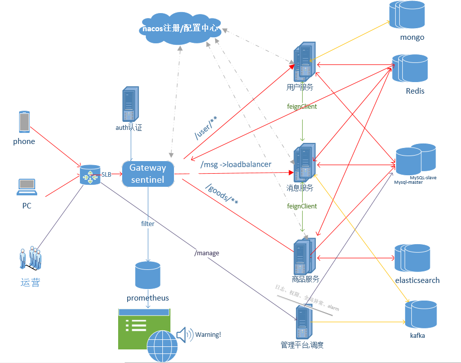
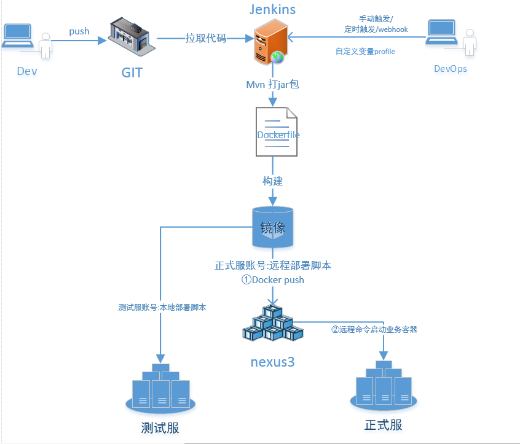

<span style="color:red;font:bold 50">jwolf-micro v1.0.0</span>
# 一、项目简介
jwolf-micro是基于最新主流技术栈实现的一套全栈微服务开源学习型项目。

# 二、系统架构

## 1.后端技术架构
```
1.后端核心springcloud alibaba2021,springcloud2020,springboot2.5.4
2.注册中心,配置中心nacos2.0.3
3.数据库mysql8,mybatis-plus
4.缓存redis
5.搜索引擎Elasticsearch7.10.x
6.消息队列rocketMq/kafka
7.网关nginx,springcloud-gateway
8.微服务调用openfegin与熔断限流sentinel1.8
9.分布式事务seata1.4.x
10.监控报警Prometheus/grafana
11.其它mongodb/minio/oauth2/spring-security等
```

## 2.大前端
```
1.后台管理Vue-element-admin
2.H5/移动端/小程序uni-app（规划）
```
## 3.AI
```
1.推荐算法（规划）
2.人脸识别（规划）
```

# 三、部署架构
```
1.fat-jar+shell 
2.docker+jenkins
3.k8s（2022实现）
```


# 四、项目目录说明
```
├── doc                                      文档
├── pom.xml
├── jwolf-common
    ├── src
    │   └── main
    │       ├── java
    │       │   └── com
    │       │       └── jwolf
    │       │           └── common            
    │       │               ├── config        配置
    │       │               ├── bean          bean
    │       │               ├── constant      常量枚举
    │       │               ├── aop           aop
    │       │               ├── exception     异常
    │       │               └── other         其它
    │       │               └── util          工具类
    │       └── resources 
├── jwolf-auth                                认证授权
├── jwolf-gateway                             网关
├── jwolf-manage                              管理平台后端
├── jwolf-manage-ui                           管理平台前端
├── jwolf-service                             微服务二级父工程
    ├── jwolf-service-xx1
    ├── jwolf-service-xx2
├── jwolf-service-api                         微服务API二级父工程
    ├── jwolf-service-xx1-api
    ├── jwolf-service-xx2-api
└── script                                    安装,启动,配置,db等脚本

```


# 五、更新日志
- 2021/11/27 README.md初始化
- 2021/12/02 V1分支【V1 架构，中间件，技术栈测试】
- 2022/xx/xx V2分支【V2 一个有灵魂的jwolf——加入核心业务】 TODO
- 2022/xx/xx V3分支【V3 AI智能化,核心组件源码分析】 TODO
# 六、quickstart
- TODO

# 七、其它说明
- master为最新分支,重要节点会拉取一个新分支作为备份


