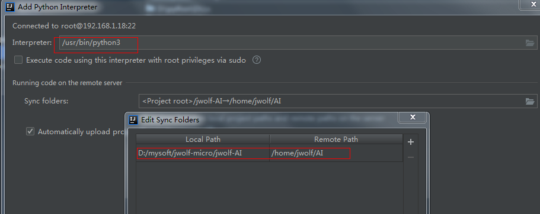

# 1.devserver安装python3
```shell
yum install -y python 3

python3 -V
```
# 2.sftp文件同步配置,2021版本IDEA略有区别，pycharm也差不多
tool->deployment->configuration
##配置sftp连接

##配置文件映射


##设置自动同步
勾选tool->deployment->Automatic Upload，ctrl+s保存时即可同步到服务器，首次可手动执行一下同步:项目右键->deployment-Upload to XXX

# 3.添加python SDK(配置远程解释器)，这个才是远程debug的关键




# 4. debug执行本地python代码


