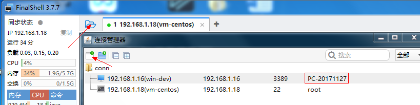
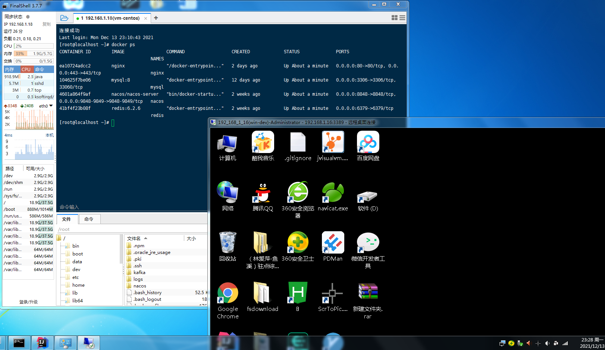
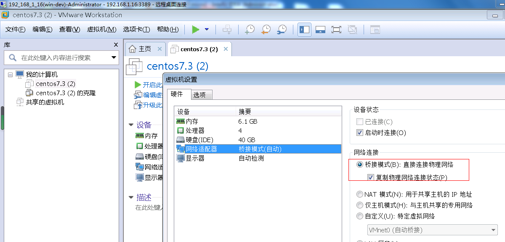

# 1.最低开发资源配额
> 作为一个全栈微服务项目，需要的基本要求还是比较高的，该项目准备了两个（8G*4核3.8GHz）windows——devserver,devpc
##devserver
> 主要通过vmvare虚拟机跑linux-centos7,用于部署各种中间件等，仅跑单机，省省还是够跑很多容器了，但后期改k8s部署资源可能还是会不够用
##devpc
> 主要用于code编码等 
# 2.服务器远程登录操作
> devpc连接devserver这里推荐使用FinalShell,它同时linux,windows远程连接，还具有基本服务器监控，文件上传下载等功能

***注意1***：被远程连接的windows要设置密码并允许远程访问,windows管理员一般是Administrator,我这里改成了PC-20171127）

**注意2**：vmware网络设置桥接模式（复制物理网络连接状态），这样devpc的finalshell就可以连接devserver windows桌面及其虚拟机里的linux咯

