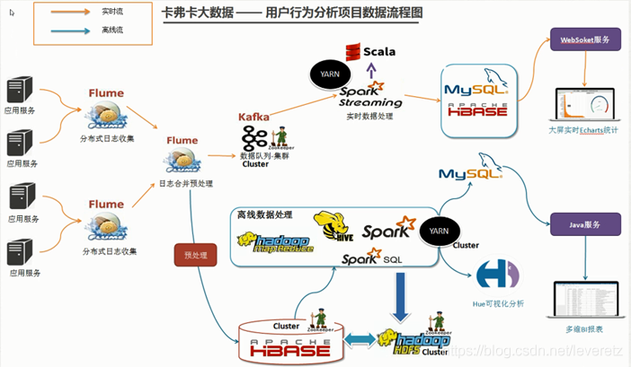
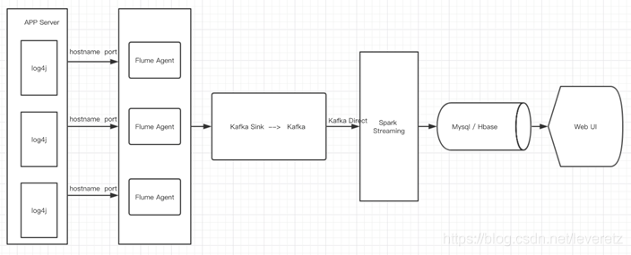
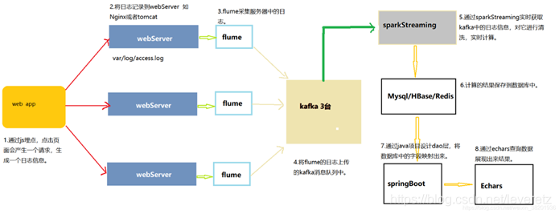
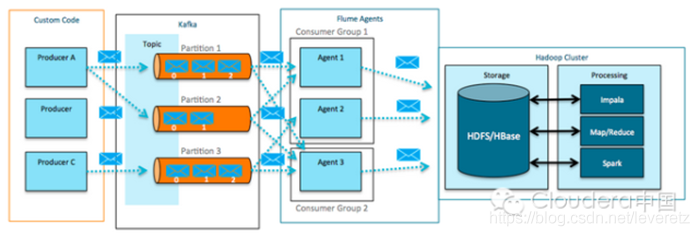

# 一、大数据常见业务流程
## 1.常见数据来源:flume采集，kafka direct等
## 2.常见sink:hbase（快）,其它如hdfs,hive（可整合python脚本做ETL,老项目用得多）,也可以local-file,采集到kafka一般是做实时计算
## 3.spark-core,spark-sql实现统计聚合,数据挖掘等;spark-stream/flink用于实时处理kafka数据;结果存入mysql/redis/ES
## 4.websocket推送或http接口传到前端，利用echart,highchart展示
# 二、一些架构图








# 三、业务需求
## 1.离线需求
> 通过管理页面配置spark任务，存入mysql后通过runtime启动spark任务（结合任务参数）,结果存入mysql
## 2.实时需求
> 略


# 四、参考
 [1.大数据架构与组件优缺点](https://blog.csdn.net/leveretz/article/details/113846380)
 [2.实时数据处理](https://blog.csdn.net/qq_24084925/article/details/80842534)
 
# 五‘组件
## hbase2.1.3 
###1.docker [安装与测试](https://hub.docker.com/r/harisekhon/hbase)
```bash
docker run --name hbase --net=host -v /etc/hbase/conf:/hbase-2.1.3/conf -v /home/data/hbase:/hbase-data  harisekhon/hbase
```
###2.修改hbase-sit.xml配置的hbase.master.hostname，hbase.regionserver.hostname，否则开发环境无法连接到hbase。因为开发环境项目的hbase java client
配置hbase连接只配置的ZK地址，故开发环境是通过获取注册到ZK的hbase master,regionserver的真实地址连接的，故需要在ZK注册网络可通的IP地址。

```bash
[root@node1 ~]# vim /etc/hbase/conf/
hadoop-metrics2-hbase.properties  hbase-env.sh                      hbase-site.xml                    regionservers
hbase-env.cmd                     hbase-policy.xml                  log4j.properties                  
<configuration>
 <property>
    <name>hbase.master.hostname</name>
    <value>192.168.1.19</value>
  </property>
  <property>
    <name>hbase.regionserver.hostname</name>
    <value>192.168.1.19</value>
  </property>
  <property>
    <name>hbase.cluster.distributed</name>
    <value>true</value>
  </property>
  <property>
    <name>hbase.rootdir</name>
    <value>/hbase-data</value>
  </property>
  <property>
    <name>hbase.zookeeper.quorum</name>
    <value>localhost:2181</value>
  </property>
</configuration>

```

###3.进入docker容器执行命令（hbase shell）进入交互界面,创建一个测试表
 ```bash
HBase Shell
Use "help" to get list of supported commands.
Use "exit" to quit this interactive shell.
For Reference, please visit: http://hbase.apache.org/2.0/book.html#shell
Version 2.1.3, rda5ec9e4c06c537213883cca8f3cc9a7c19daf67, Mon Feb 11 15:45:33 CST 2019
Took 0.0061 seconds                                                                                                                                                       
hbase(main):001:0> create 'person','info'
Created table person
Took 2.0373 seconds                                                                                                                                                       
=> Hbase::Table - person
hbase(main):002:0> list
TABLE                                                                                                                                                                     
person                                                                                                                                                                    
1 row(s)
Took 0.0622 seconds                                                                                                                                                       
=> ["person"]

```
###4.本地java连接hbase进行CRUD；hbase的API不好用，建议做个再封装
```java
package com.jwolf.bigdata;

import lombok.SneakyThrows;
import org.apache.hadoop.hbase.HBaseConfiguration;
import org.apache.hadoop.hbase.TableName;
import org.apache.hadoop.hbase.client.Connection;
import org.apache.hadoop.hbase.client.ConnectionFactory;
import org.apache.hadoop.hbase.client.Put;

import java.util.Arrays;
import java.util.HashMap;
import java.util.Map;
import java.util.stream.Collectors;

/**
 * Description: TODO
 *
 * @author majun
 * @version 1.0
 * @date 2022-01-12 00:19
 */
public class HbaseTest {

    @SneakyThrows
    public static void main(String[] args) {
        org.apache.hadoop.conf.Configuration configuration = HBaseConfiguration.create();
        configuration.set("hbase.zookeeper.quorum", "192.168.1.19");
        configuration.set("hbase.zookeeper.port", "2181");
        configuration.set("hbase.zookeeper.znode", "/hbase");
        configuration.set("hbase.client.keyvalue.maxsize", "1572864000");
        configuration.set("hbase.regionserver.port", "1572864000");
        long t = System.currentTimeMillis();
        Connection conn = ConnectionFactory.createConnection(configuration);
        System.out.println("连接耗时" + (System.currentTimeMillis() - t));
        //查看所有表
        // todo:连接不上，docker log显示 Client attempting to establish new session at /192.168.1.11:62303
        String tables = Arrays.stream(conn.getAdmin().listTableNames()).map(TableName::getNameAsString).collect(Collectors.joining());
        System.out.println("已存在表：" + tables);
        //存入数据
        Map<String, String> cloumns = new HashMap<String, String>();
        cloumns.put("name", "zzq");//列名和值
        cloumns.put("age", "22");
        //往表中的第row=1的info族中增加了名为name、age数据
        Put put = new Put("1".getBytes());
        put.addColumn("info".getBytes(), "name".getBytes(), "jwolf".getBytes());
        put.addColumn("info".getBytes(), "age".getBytes(), "18".getBytes());
        conn.getTable(TableName.valueOf("person")).put(put);
        System.out.println("增加成功");

    }

}


```